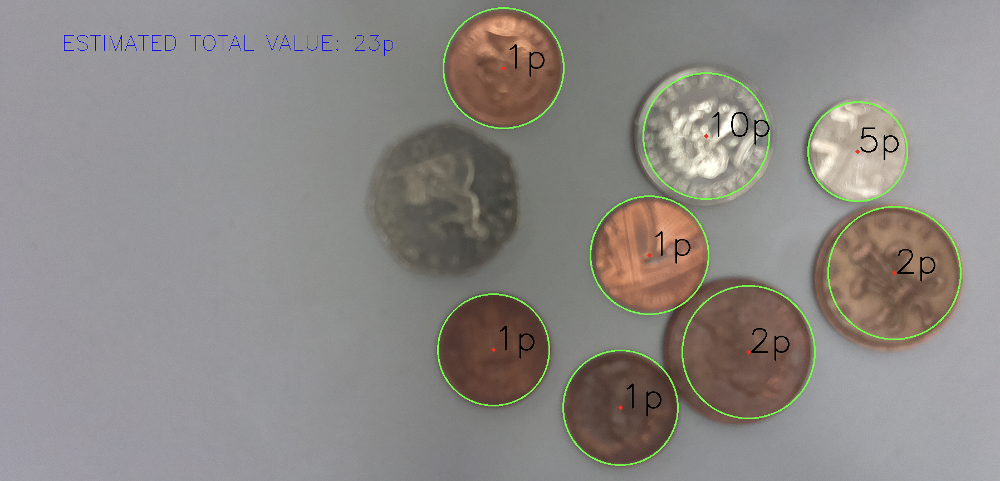

# coin-detector-OpenCV
Python program to detect coins and sum up the values using OpenCV.

Hough Circle Transformation is used to detect circles in an image and classification is done based on the brightness value and the radii of the coins.

## Output:

